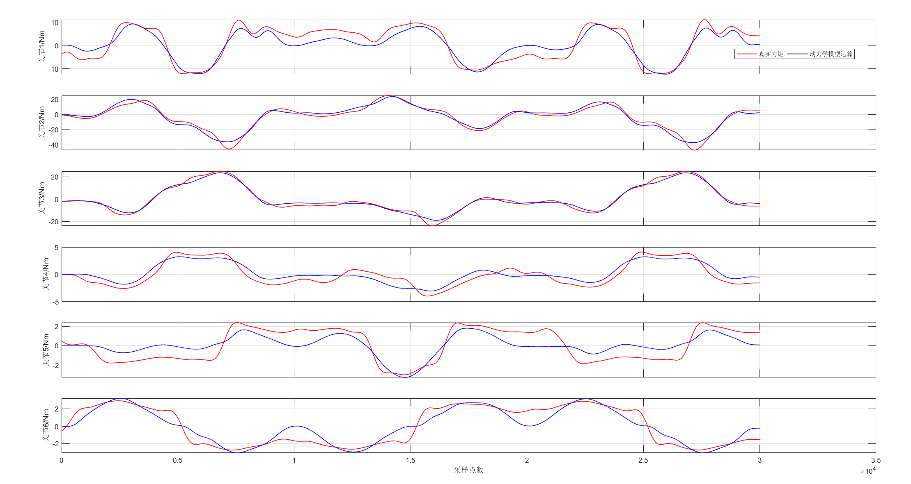

该代码为递归牛顿欧拉（Recursive Newton-Euler Algorithm(RNEA)）计算逆动力学的C++代码版本

代码文件说明：
scr/SR4_RNEA_tau.cpp：用来计算RNEA动力学力矩，针对6轴ROKAE SR4

scr/SR4_tau_f.cpp：用来计算关节摩擦力矩，针对6轴ROKAE SR4

scr/T_R_Mat_out.cpp：计算齐次变换矩阵与旋转矩阵

scr/total_tau.cpp：用RNEA力矩结果与摩擦力矩结果计算关节总力矩

scr/test_main_taufadd.cpp：用total_tau函数计算总力矩输出结果（AI）

scr/test_main.cpp：用来分别输出关节力矩与摩擦力矩（AI）

test文件夹：用来进行代码测试，有单一输出结果，也有没封装成函数的RNEA代码

test/test_main.cpp：该测试代码用来测试scr的函数是否能在外部调用

test/test_pinocchio_6axis.cpp：该测试代码用pinocchio验证六轴机器人动力学计算结果，不用urdf

test/test_pinocchio_rnea.cpp：该测试代码用pinocchio验证六轴机器人动力学计算结果，用urdf

test/test_pinoccho_test.cpp：该测试代码用pinocchio验证三轴机器人动力学计算结果，不用urdf

test/test_rnea_6axis.cpp：该测试代码用自己的RNEA进行六轴机器人动力学计算

test/test_rnea_add_fri.cpp：同样为自己写的RNEA六轴动力学计算，但是加入摩擦力矩结果

test/test_rnea_forward.cpp：该测试代码为未封装成函数的RNEA计算代码

test/test_rnea_fun.cpp：该测试代码用来测试封装的函数计算是否能输出正确结果

urdf_and_xml/xMateSR4C_gen.urdf：6轴ROKAE SR4机器人urdf文件，但是用来计算动力学并不准确

data_in:输入的六轴文件，包括关节速度、角速度与角加速度

最终运行文件:
test/test_RNEA_FPGA_tau_out.cpp

文件夹：time_test
用于对比三种方法的计算速度，采取10 轮、每轮 100000 次平均

最终计算结果与真实采集数据对比：
